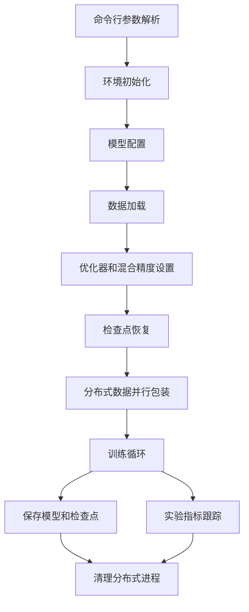

# MiniMind 预训练脚本设计文档

## 1. 高层次设计 (HLD)

### 1.1 系统概述

`train_pretrain.py` 是 MiniMind 模型的预训练脚本，负责执行模型的预训练过程，包括数据加载、模型训练、检查点保存和实验跟踪等功能。该脚本支持分布式训练、混合精度训练和从检查点恢复训练等高级特性。

### 1.2 核心组件

| 组件 | 职责 | 实现方式 |
|------|------|----------|
| 命令行参数解析 | 解析和管理训练配置参数 | 使用 `argparse` 模块 |
| 环境初始化 | 初始化分布式训练环境和设置随机种子 | 调用 `init_distributed_mode` 和 `setup_seed` 函数 |
| 模型配置 | 配置模型参数和创建模型实例 | 使用 `MiniMindConfig` 类和 `init_model` 函数 |
| 数据加载 | 加载和预处理预训练数据 | 使用 `PretrainDataset` 类和 `DataLoader` |
| 训练循环 | 执行模型训练过程 | 实现 `train_epoch` 函数 |
| 检查点管理 | 保存和加载训练检查点 | 使用 `lm_checkpoint` 函数 |
| 实验跟踪 | 跟踪训练指标和实验结果 | 使用 `swanlab`（作为 wandb 接口） |

### 1.3 系统架构



### 1.4 关键流程

1. **初始化流程**：解析命令行参数 → 初始化分布式环境 → 设置随机种子 → 创建保存目录 → 配置模型参数
2. **训练准备流程**：设置混合精度 → 初始化实验跟踪 → 创建模型和分词器 → 加载数据集 → 初始化优化器和梯度缩放器 → 恢复检查点 → 包装 DDP
3. **训练执行流程**：遍历每个 epoch → 遍历每个 batch → 前向传播 → 计算损失 → 反向传播 → 梯度裁剪 → 参数更新 → 记录日志 → 保存检查点
4. **清理流程**：销毁分布式进程组

## 2. 详细设计

### 2.1 模块分解

#### 2.1.1 命令行参数解析模块

**功能**：解析和管理训练配置参数

**实现**：使用 `argparse` 模块创建参数解析器，定义各种训练相关的参数，如 batch size、学习率、训练轮数等。

**参数说明**：
- `--save_dir`：模型保存目录
- `--save_weight`：保存权重的前缀名
- `--epochs`：训练轮数
- `--batch_size`：批次大小
- `--learning_rate`：初始学习率
- `--device`：训练设备
- `--dtype`：混合精度类型
- `--num_workers`：数据加载线程数
- `--accumulation_steps`：梯度累积步数
- `--grad_clip`：梯度裁剪阈值
- `--log_interval`：日志打印间隔
- `--save_interval`：模型保存间隔
- `--hidden_size`：隐藏层维度
- `--num_hidden_layers`：隐藏层数量
- `--max_seq_len`：训练的最大截断长度
- `--use_moe`：是否使用 MoE 架构
- `--data_path`：预训练数据路径
- `--from_weight`：基于哪个权重训练
- `--from_resume`：是否自动检测&续训
- `--use_wandb`：是否使用 wandb
- `--wandb_project`：wandb 项目名

#### 2.1.2 环境初始化模块

**功能**：初始化分布式训练环境和设置随机种子

**实现**：
- 调用 `init_distributed_mode()` 初始化分布式训练环境
- 根据分布式环境设置设备
- 调用 `setup_seed()` 设置随机种子，确保训练可复现

#### 2.1.3 模型配置模块

**功能**：配置模型参数和创建模型实例

**实现**：
- 创建 `MiniMindConfig` 实例，设置隐藏层维度、隐藏层数量和是否使用 MoE 等参数
- 调用 `lm_checkpoint()` 检查是否需要从检查点恢复训练

#### 2.1.4 混合精度设置模块

**功能**：设置混合精度训练相关参数

**实现**：
- 根据设备类型和指定的精度类型，创建自动混合精度上下文管理器
- 对于 CPU 设备，使用 `nullcontext()` 作为上下文管理器

#### 2.1.5 实验跟踪模块

**功能**：跟踪训练指标和实验结果

**实现**：
- 如果启用 wandb 且是主进程，初始化 swanlab（作为 wandb 接口）
- 配置运行名称、项目名和恢复 ID

#### 2.1.6 模型和数据模块

**功能**：创建模型实例、分词器和数据加载器

**实现**：
- 调用 `init_model()` 创建模型实例和分词器
- 创建 `PretrainDataset` 实例加载预训练数据
- 创建 `DistributedSampler` 或使用默认采样器
- 初始化 `GradScaler` 和 `AdamW` 优化器

#### 2.1.7 检查点恢复模块

**功能**：从检查点恢复训练状态

**实现**：
- 如果存在检查点数据，加载模型状态字典、优化器状态字典、梯度缩放器状态字典
- 恢复 epoch 和 step 计数

#### 2.1.8 分布式数据并行模块

**功能**：包装模型为分布式数据并行模式

**实现**：
- 如果初始化了分布式环境，设置模型的 `_ddp_params_and_buffers_to_ignore` 属性
- 使用 `DistributedDataParallel` 包装模型

#### 2.1.9 训练循环模块

**功能**：执行模型训练过程

**实现**：
- 遍历每个 epoch
- 对于每个 epoch，创建数据加载器
- 如果是第一个 epoch 且存在检查点，使用 `SkipBatchSampler` 跳过已训练的 batch
- 调用 `train_epoch()` 函数执行训练

#### 2.1.10 训练 epoch 模块

**功能**：执行单个 epoch 的训练过程

**实现**：
- 初始化交叉熵损失函数
- 遍历数据加载器中的每个 batch
- 移动数据到指定设备
- 计算学习率并更新优化器的学习率
- 使用混合精度上下文管理器执行前向传播
- 计算损失（包括 logits 损失和辅助损失）
- 执行反向传播
- 当达到累积步数时，执行梯度裁剪和参数更新
- 定期打印日志和保存检查点
- 清理中间变量，释放内存

#### 2.1.11 检查点保存模块

**功能**：保存模型权重和训练检查点

**实现**：
- 定期（根据 `save_interval`）保存模型权重
- 保存完整的检查点（包括模型状态、优化器状态、梯度缩放器状态、epoch 和 step 计数等）
- 对于分布式训练，保存模型的 `module` 状态字典
- 将模型权重转换为半精度以减少存储空间

#### 2.1.12 清理模块

**功能**：清理分布式进程

**实现**：如果初始化了分布式环境，调用 `dist.destroy_process_group()` 销毁进程组

### 2.2 核心函数详解

#### 2.2.1 `train_epoch(epoch, loader, iters, start_step=0, wandb=None)`

**功能**：执行单个 epoch 的训练过程

**参数**：
- `epoch`：当前 epoch 索引
- `loader`：数据加载器
- `iters`：当前 epoch 的总迭代次数
- `start_step`：起始 step 索引，默认为 0
- `wandb`：实验跟踪对象，默认为 None

**实现细节**：
1. 初始化交叉熵损失函数
2. 遍历数据加载器中的每个 batch
3. 移动数据到指定设备
4. 计算学习率并更新优化器的学习率
5. 使用混合精度上下文管理器执行前向传播
6. 计算损失（包括 logits 损失和辅助损失）
7. 执行反向传播
8. 当达到累积步数时，执行梯度裁剪和参数更新
9. 定期打印日志和保存检查点
10. 清理中间变量，释放内存

#### 2.2.2 主函数流程

**功能**：执行完整的训练流程

**实现细节**：
1. 解析命令行参数
2. 初始化分布式训练环境和设置随机种子
3. 创建保存目录和配置模型参数
4. 检查是否需要从检查点恢复训练
5. 设置混合精度训练
6. 初始化实验跟踪
7. 创建模型实例、分词器和数据加载器
8. 初始化优化器和梯度缩放器
9. 从检查点恢复训练状态
10. 包装模型为分布式数据并行模式
11. 执行训练循环
12. 清理分布式进程

### 2.3 数据结构

#### 2.3.1 模型配置

**`MiniMindConfig`**：
- `hidden_size`：隐藏层维度
- `num_hidden_layers`：隐藏层数量
- `use_moe`：是否使用 MoE 架构

#### 2.3.2 训练参数

**`args` 对象**：
- 包含所有命令行解析的参数，如 batch_size、learning_rate、epochs 等

#### 2.3.3 检查点数据

**`ckp_data` 字典**：
- `model`：模型状态字典
- `optimizer`：优化器状态字典
- `scaler`：梯度缩放器状态字典
- `epoch`：当前 epoch 索引
- `step`：当前 step 索引
- `wandb_id`：实验跟踪 ID

### 2.4 性能优化

1. **混合精度训练**：使用 `torch.cuda.amp.autocast` 和 `GradScaler` 减少内存使用和提高训练速度
2. **梯度累积**：通过 `accumulation_steps` 参数实现梯度累积，相当于增大 batch size
3. **分布式训练**：使用 `DistributedDataParallel` 和 `DistributedSampler` 实现多 GPU 并行训练
4. **内存优化**：定期清理中间变量，使用半精度保存模型权重
5. **高效数据加载**：使用 `num_workers` 和 `pin_memory` 优化数据加载速度

### 2.5 容错和恢复

1. **检查点恢复**：支持从检查点恢复训练，包括模型状态、优化器状态和训练进度
2. **跳过已训练 batch**：当从检查点恢复时，使用 `SkipBatchSampler` 跳过已训练的 batch
3. **分布式训练容错**：使用 PyTorch 的分布式训练机制，支持多进程训练的容错

### 2.6 扩展性

1. **模型架构**：通过 `MiniMindConfig` 支持不同的模型架构配置，包括隐藏层维度、层数和是否使用 MoE
2. **数据格式**：通过 `PretrainDataset` 支持不同的预训练数据格式
3. **实验跟踪**：支持使用 wandb 进行实验跟踪和可视化
4. **训练配置**：通过命令行参数支持灵活的训练配置，无需修改代码

## 3. 代码优化建议

1. **参数验证**：添加对命令行参数的验证，确保参数值在合理范围内
2. **错误处理**：添加更详细的错误处理和异常捕获，提高脚本的鲁棒性
3. **日志系统**：使用更完善的日志系统，如 `logging` 模块，替代简单的 `Logger` 函数
4. **配置文件支持**：添加对配置文件的支持，方便管理复杂的训练配置
5. **模型导出**：添加模型导出功能，支持导出为 ONNX 或 TensorRT 格式
6. **性能监控**：添加更详细的性能监控，如 GPU 利用率、内存使用等
7. **代码结构**：将功能模块进一步分解为单独的函数或类，提高代码的可维护性
8. **文档完善**：添加更详细的代码注释和文档，方便其他开发者理解和使用

## 4. 输入输出示例

### 4.1 输入示例

**命令行输入**：
```bash
python trainer/train_pretrain.py --epochs 3 --batch_size 32 --learning_rate 2e-4 --hidden_size 512 --num_hidden_layers 8 --max_seq_len 512 --use_moe 0 --data_path ../dataset/pretrain_hq.jsonl --use_wandb
```

### 4.2 输出示例

**控制台输出**：
```
Epoch:[1/3](100/1000), loss: 10.5678, logits_loss: 10.2345, aux_loss: 0.3333, learning_rate: 0.00020000, epoch_time: 10.456min
Epoch:[1/3](200/1000), loss: 9.8765, logits_loss: 9.5432, aux_loss: 0.3333, learning_rate: 0.00019999, epoch_time: 10.234min
...
Epoch:[3/3](1000/1000), loss: 6.1234, logits_loss: 5.7890, aux_loss: 0.3333, learning_rate: 0.00000001, epoch_time: 9.876min
```

**保存的文件**：
- `../out/pretrain_512.pth`：模型权重文件
- `../checkpoints/pretrain_512.pt`：完整检查点文件

**实验跟踪**：
- 在 swanlab 中查看训练指标、学习率变化和损失曲线

## 5. 总结

`train_pretrain.py` 是一个功能完整、性能优化的 MiniMind 模型预训练脚本，支持分布式训练、混合精度训练、检查点恢复和实验跟踪等高级特性。通过灵活的命令行参数配置，可以适应不同的训练需求和硬件环境。脚本的设计清晰，模块划分合理，代码实现高效，为 MiniMind 模型的预训练提供了可靠的支持。